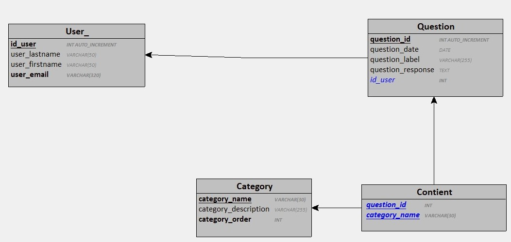

# Foire_au_question_base_de_donnee

## Foire aux Question

 Vous êtes en charge de l’implémentation d’une petite base de données pour un logiciel de “foire aux questions” (FAQ).

L’ingénieur du projet s’est chargé de l’analyse du besoin et vous fournit le résultat de son travail.

- Un utilisateur est caractérisé par :
    - un identifiant numérique
    - un nom
    - un prénom
    - une adresse email
- Un utilisateur peut ajouter des questions
- Un utilisateur peut modifier les questions qu’il a créé
- Une question est caractérisée par :
    - un identifiant numérique
    - une date de publication
    - la question
    - la réponse à la question
- On doit connaitre l’auteur de chaque question/réponse
- Les questions sont classées par catégories
- Une question peut appartenir à une ou plusieurs catégories
- Une catégorie est caractérisée par:
- Un nom de catégorie (identifiant)
- Une description de la catégorie
- On doit pouvoir déterminer dans quel ordre les catégories s’affichent

Votre tâche consiste à créer la base de données correspondante.

## La base de données

**Nom de la base de données à créer: mini_faq.**

A partir du dictionnaire des données et des règles de gestion ci-dessous, créer la base de données correspondante.

### Le dictionnaire de données

| Mnémonique               | Signification                          | Type          | Longueur | Remarques                                      |
|--------------------------|----------------------------------------|---------------|----------|------------------------------------------------|
| user_id                  | Identifiant de l'utilisateur          | Numérique     | 11       | Identifiant auto incrémenté                   |
| user_email               | Email de l'utilisateur                | Alphanumérique | 128      | Obligatoire, unique, format email              |
| user_lastname            | Nom de l'utilisateur                  | Alphabétique   | 50       | Obligatoire                                    |
| user_firstname           | Prénom de l'utilisateur               | Alphabétique   | 50       | Obligatoire                                    |
| question_id              | Identifiant de la question             | Numérique     | 11       | Identifiant auto incrémenté                   |
| question_date            | Date de publication de la question     | Date          | -        | Obligatoire, format YYYY-MM-DD                |
| question_label           | Intitulé de la question                | Alphanumérique | 255      | Obligatoire                                    |
| question_response        | Réponse à la question                  | Alphanumérique | 65535    | Obligatoire                                    |
| category_name            | Nom de la catégorie                    | Alphabétique   | 30       | Identifiant                                    |
| category_description     | Description de la catégorie            | Alphanumérique | 255      | Facultatif                                     |
| category_order           | Ordre d'affichage de la catégorie      | Numérique     | 3        | Obligatoire, unique                            |

## Règles de gestion

- 1 utilisateur publie 0 ou plusieurs questions.
- 1 question est publiée par 1 utilisateur.
- 1 question est contenue dans 1 ou plusieurs catégories.
- 1 catégorie contient 0 ou plusieurs questions.

---

## Modèle Logique (textuel)

- **users** = (`user_id`, `user_email`, `user_lastname`, `user_firstname`);
- **questions** = (`question_id`, `question_date`, `question_label`, `question_response`, `#user_id`);
- **categories** = (`category_name`, `category_description`, `category_order`);
- **categories_questions** = (`#question_id`, `#category_name`);

---

## Préparez-vous !

- Créez un répertoire pour le projet (pour stocker vos fichiers SQL).
- Lancez votre serveur SQL depuis Laragon (ou équivalent).
- Connectez-vous au serveur de base de données avec MySQL Workbench (ou équivalent).

---

## Travail à réaliser

1. **Créez un 1er script SQL** qui contiendra :
   - L'instruction pour supprimer la base de données si elle existe.
   - L'instruction pour créer la base de données.
   - L'instruction pour sélectionner la base de données.
   - Les instructions pour créer les différentes tables et leurs contraintes.

2. Créez un **2ème script SQL** qui contiendra les instructions pour insérer le jeu d'essai fourni.

3. Créez un **3ème script SQL** qui contiendra les requêtes à implémenter.

<custom-element data-json="%7B%22type%22%3A%22table-metadata%22%2C%22attributes%22%3A%7B%22title%22%3A%22Jeu%20d'essai%20-%20Utilisateurs%22%7D%7D" />

| Identifiant | Nom      | Prénom  | Email                     |
|-------------|----------|---------|---------------------------|
| 1           | Rabbit   | Zora    | zorb@example.com          |
| 2           | Patchouli| Édouard | patchouli@example.fr      |
| 3           | Satiti   | Eva     | eva.stt@example.com       |

---

| Nom                | Description                                      | Ordre d'affichage |
|--------------------|--------------------------------------------------|-------------------|
| Bases de données    | Les questions relatives aux bases de données      | 2                 |
| SQL                | Les questions sur le langage SQL                 | 3                 |
| NoSQL              | Les questions sur l'approche NoSQL              | 4                 |
| PHP                | Les questions relatives à PHP                   | 1                 |

---

| Identifiant | Date de publication | Intitulé                                                                                     | Réponse                                                                                     | Identifiant auteur |
|-------------|---------------------|---------------------------------------------------------------------------------------------|--------------------------------------------------------------------------------------------|--------------------|
| 1           | 2024-11-23          | Dans MySQL, quel type de données permet de stocker des valeurs numériques dont le maximum est 127 ? | Le type TINYINT stocke des valeurs numériques comprises entre -128 et 127.                     | 3                  |
| 2           | 2024-11-23          | Quels sont les principaux serveurs SQL gratuits ?                                             | MySQL, MariaDB, PostgreSQL, SQLite                                                          | 2                  |
| 3           | 2024-11-27          | Que signifie le sigle SGBDR ?                                                                | Système de Gestion de Bases de Données Relationnelles                                       | 1                  |
| 4           | 2024-12-05          | Que signifie le sigle SQL ?                                                                  | Structured Query Language                                                                   | 2                  |
| 5           | 2024-12-05          | Que signifie le sigle NoSQL ?                                                                | Not Only SQL !                                                                              | 3                  |

---

- La question n°1 appartient aux catégories : **Bases de données** et **SQL**.
- La question n°2 appartient aux catégories : **Bases de données** et **SQL**.
- La question n°3 appartient à la catégorie : **Bases de données**.
- La question n°4 appartient aux catégories : **Bases de données** et **SQL**.
- La question n°5 appartient aux catégories : **Bases de données** et **NoSQL**.

## Requêtes SQL à implémenter

1. Sélectionner tous les utilisateurs (identifiant, nom, prénom, email).

2. Sélectionner toutes les questions (date, intitulé, réponse, identifiant utilisateur) triées par date de la plus ancienne à la plus récente.

3. Sélectionner les questions (identifiant, date, intitulé, réponse) de l’utilisateur n°2.

4. Sélectionner les questions (date, intitulé, réponse, identifiant utilisateur) de l’utilisateur Eva Satiti.

5. Sélectionner les questions (identifiant, date, intitulé, réponse, identifiant utilisateur) dont l’intitulé contient “SQL”. Le résultat est trié par le titre et par ordre décroissant.

6. Sélectionner les catégories (nom, description) sans question associée.

7. Sélectionner les questions triées par titre (ordre alphabétique) avec le nom et prénom de l’auteur (nécessite une jointure).

8. Sélectionner les catégories (nom) avec, pour chaque catégorie le nombre de questions associées (nécessite une jointure).

